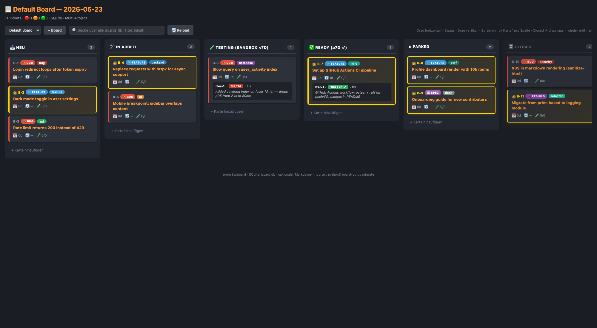
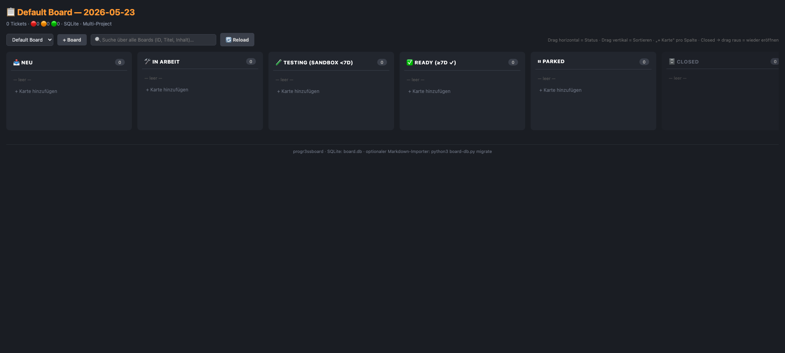
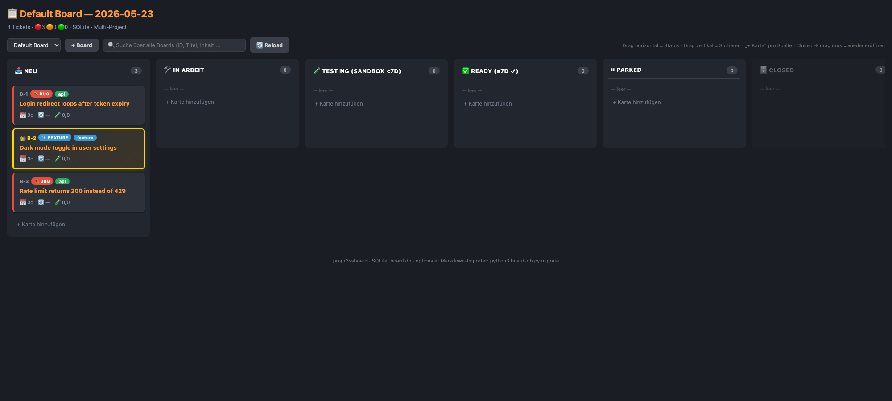
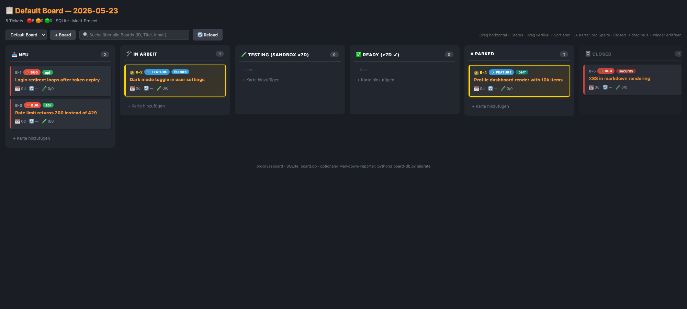
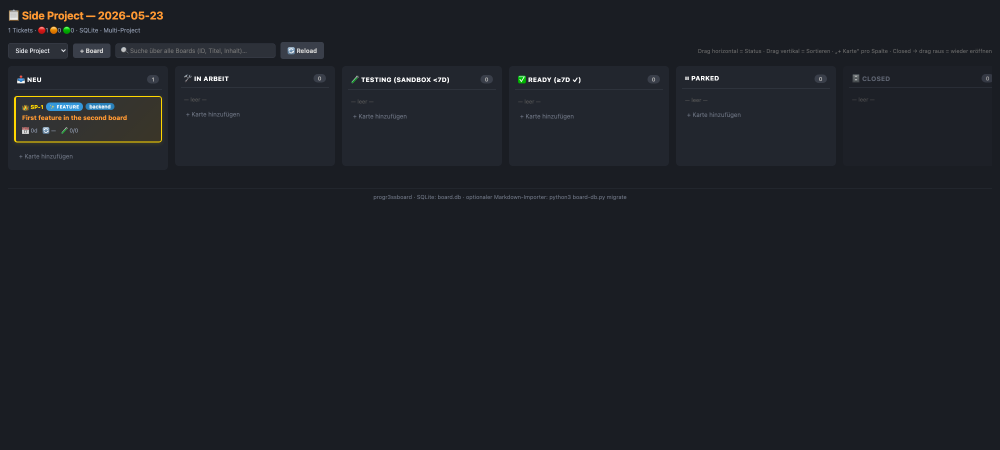
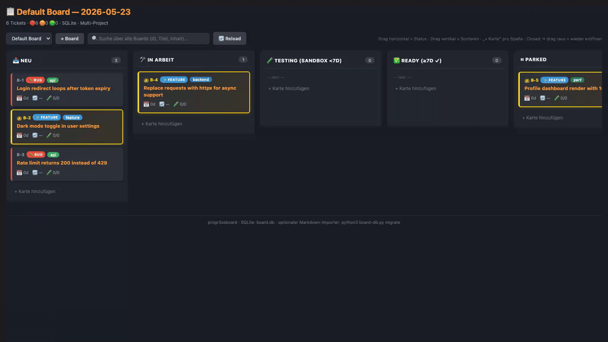

# progr3ssboard

A **local, self-hosted Kanban board** in a single Python file.
SQLite-backed, zero external dependencies, drag-drop UI, runs on your machine.

For when you want to track tickets without giving them to anyone else.



> Six columns by lifecycle: **NEU** (open, untouched) · **IN ARBEIT** (active) ·
> **TESTING** (deployed, sandbox <7d) · **READY** (deployed, ≥7d stable) ·
> **PARKED** (waiting on something) · **CLOSED** (done; drag out to re-open).
> Drag horizontally to change status, vertically to reorder within a column.

---

## Why

You have N small side-projects. Each deserves its own backlog, but spinning up
a hosted tracker per project is overkill, and you don't want your task list
in someone else's database.

`progr3ssboard` is a Python script that serves a Kanban board from `localhost:8766`
(or your LAN-IP, if you want it on your phone). It uses SQLite for storage,
nothing else. One file to run, one file (per board) on disk.

## Features

- **6-column Kanban** — NEU / IN ARBEIT / TESTING / READY / PARKED / CLOSED
  (configurable wording per board)
- **Drag & drop** — horizontal between columns changes status, vertical within
  a column reorders (persists to `sort_order` in SQLite)
- **Multi-board** — one Python process serves any number of independent boards,
  each with its own SQLite file and ID prefix. Switch via top-bar dropdown
  or URL parameter `?project=<slug>`
- **Create new boards from the UI** — `+ Board` button, persists to
  `boards/projects.json`
- **Cross-board search** — type once in the top bar, see hits from every board
- **Per-ticket modal** — view / edit / links (between tickets) / image
  attachments / git worktree integration
- **Git worktree integration** — create a worktree per ticket with one click
  (branch `ticket/<ID>`); auto-discovery of existing worktrees
- **Optional Markdown importer** — bootstrap a board from an existing
  `BACKLOG.md` file (one section per ticket, header `## <ID>: <Title>`)
- **No dependencies** — stdlib `http.server`, `sqlite3`, `pathlib`, `re`.
  Works with Python 3.9+

## How it works in 4 clicks

A new install starts with an empty board. Add some cards, move them around,
spin up a second board — that's the whole tour.

### 1. Empty board, ready to use



Six columns by lifecycle. Every column except CLOSED has a faint `+ Karte
hinzufügen` button — click to add a card directly into that status.

### 2. Add a few cards



Cards get an auto-generated ID (`B-1`, `B-2`, …), type-badge (BUG / FEATURE /
SPEC / …), tag-pill in your chosen tag color, and a reset-age indicator. Card
border colors mirror the priority/age traffic light (red / orange / green).

### 3. Drag to change status, drag to re-order



Drag a card horizontally to change its status (`open` → `progress` → … →
`closed`). Drag vertically inside a column to re-order. Drop indicators (orange
bars) show where the card will land. Drag out of CLOSED to re-open.

### 4. Multiple boards under one server



Click `+ Board` in the top bar to create another independent board with its
own SQLite file and ticket prefix. Switch between boards with the dropdown,
or use the URL: `?project=<slug>`. Cards do not bleed between boards; the
global search above does scan all of them.

## See it in motion



Drag-drop and the per-ticket modal in ~14 seconds (recorded with playwright,
loop-safe).

## Install & run

```bash
git clone https://github.com/<your-github>/progr3ssboard.git
cd progr3ssboard
python3 progr3ssboard.py --serve
# → http://localhost:8766
```

Default bind is `0.0.0.0`, so the board is also reachable from other devices
on your LAN (the startup output prints the LAN URL). Restrict to localhost
with `--host 127.0.0.1`.

## Adding boards

Two ways:

1. **Via UI** — click `+ Board` in the top bar, give it a slug, a name, and a
   ticket-ID prefix (e.g. `TASK` → tickets become `TASK-1`, `TASK-2` …).
2. **Edit `board-db.py`** — add an entry to the `PROJECTS` dict for boards you
   want hardcoded (survives `git pull` of progr3ssboard updates). UI-created
   boards live in `boards/projects.json` (gitignored).

## Importing from existing Markdown

If you already have a `BACKLOG.md` with sections like

```markdown
## B-42: Login redirect loops on expired token
**Status:** open
**Tag:** `auth`
…body…
```

set `source_md` in the project config and run `python3 board-db.py migrate`.
Tickets, tags, and last-reset dates are extracted; the original Markdown is
never modified.

## Branding the footer (your fork)

The bottom-right of every board shows a small mark from `assets/logo.svg`.
Replace that file with your own SVG (or PNG/JPG — file extension drives the
mime type) to brand your fork. The default is a six-bar mark in the project's
accent color; height in the footer is fixed to ~14 px, so anything legible at
that scale works.

## Architecture

- `progr3ssboard.py` — HTTP server, HTML/CSS/JS, REST endpoints, business logic
- `board-db.py` — SQLite schema, project registry, optional Markdown importer
- `boards/<slug>/board.db` — per-board SQLite file
- `boards/<slug>/attachments/<ticket-id>/` — image uploads

Storage is plain SQLite, so any SQLite CLI/GUI can read/edit your tickets if
you ever need to bypass the UI.

## API

All endpoints accept `?project=<slug>` (defaults to the first project):

```
GET    /                                List + Kanban view (HTML)
GET    /api/tickets                     List tickets (JSON)
GET    /api/tickets/<id>                Single ticket
POST   /api/tickets                     Create (body: {title, type, status, prio})
PUT    /api/tickets/<id>                Update fields
PUT    /api/tickets/<id>/reorder        Move + sort (body: {status, before_id, after_id})
DELETE /api/tickets/<id>                Delete
GET    /api/tickets/<id>/hierarchy      Parent + children
GET    /api/tickets/<id>/attachments    List images
POST   /api/tickets/<id>/attachments    Upload (raw body + X-Filename header)
GET    /api/tickets/<id>/worktree       Worktree status
POST   /api/tickets/<id>/worktree       Create worktree
DELETE /api/tickets/<id>/worktree       Remove worktree
GET    /api/links/<id>                  Ticket links
POST   /api/links                       Create link (body: {src, dst, type})
DELETE /api/links/<id>                  Remove link
GET    /api/search?q=…                  Cross-board search
GET    /api/projects                    List boards
POST   /api/projects                    Create board (body: {key, name, id_prefix})
```

## Contributing

**Everyone is welcome** — bug reports, feature ideas, code, docs, screenshots,
critique of weird design choices. The project will stay small on purpose, but
contributions are read and answered.

- 🐛 **Bug?** → [Open an Issue](https://github.com/n-e-t-d-i-v-e-r/progr3ssboard/issues/new) (template in [CONTRIBUTING.md](CONTRIBUTING.md))
- 💡 **Feature idea?** → Issue with `[idea]` in the title, or start a [Discussion](https://github.com/n-e-t-d-i-v-e-r/progr3ssboard/discussions)
- 🛠 **Want to code?** → Fork → branch → PR. Details and design constraints in [CONTRIBUTING.md](CONTRIBUTING.md)
- ❓ **Question?** → Discussions, not Issues

The maintainer is a one-person operation. Don't expect instant turnaround,
but expect honest answers.

## License

MIT — see [LICENSE](LICENSE).

## Status

Early, opinionated. Bug reports welcome; feature requests will be evaluated
against "does this stay a single Python file with zero dependencies".
